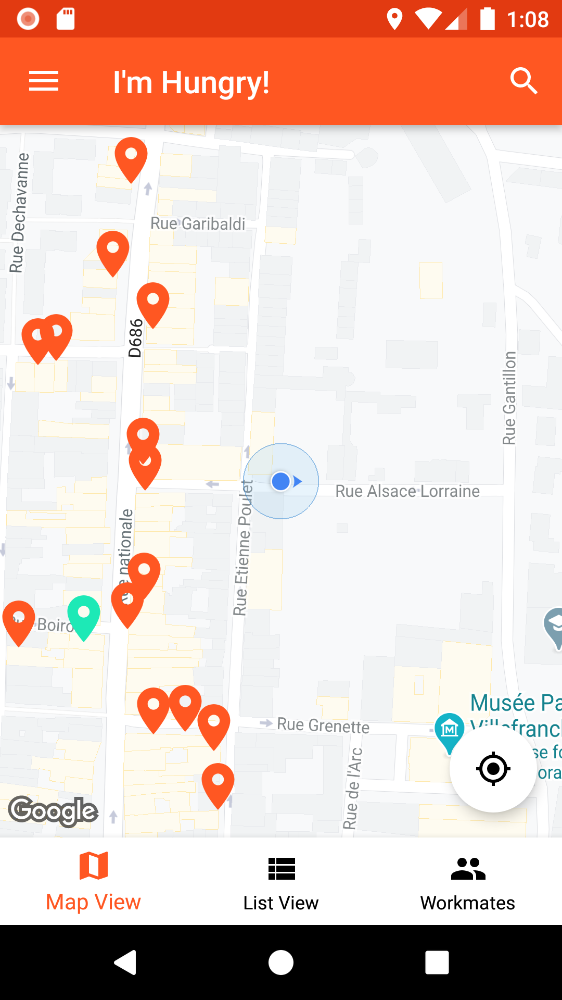

# Go4Lunch

**Goal**: Create a collaborative application used by all employees. It allows you to search for a restaurant in the area, then select the one of your choice by sharing it with your colleagues.

## Phone display

     

       

       

     

## Requirements
* Computer (Windows, Mac or Linux)
* Android Studio

## Setup the project in Android studio
1. Download the project code, preferably using `git clone https://github.com/YannMancel/Go4Lunch.git`.
2. In Android Studio, select *File* | *Open...*
3. Select the project
     
     
## Compile and execute the project in Android studio
1. In Android Studio, select *Run* | *Run...*
2. Choose `app` in *Run dialog*
3. Select a device (*Available Virtual Devices* or *Connected Devices*)
4. Select `OK` in *Select Deployment Target dialog*

## Wiki
* [Android Jetpack](https://developer.android.com/jetpack)
  * [Architecture Components](https://developer.android.com/topic/libraries/architecture/)
    * [LiveData](https://developer.android.com/topic/libraries/architecture/livedata)
    * [ViewModel](https://developer.android.com/topic/libraries/architecture/viewmodel)
    * [Navigation](https://developer.android.com/guide/navigation/)
    * [WorkManager](https://developer.android.com/topic/libraries/architecture/workmanager)
  * [Foundation Multidex](https://developer.android.com/studio/build/multidex.html)
  
* [Firebase](https://firebase.google.com/)
  * [Authentication](https://firebase.google.com/docs/auth)
  * [Firestore](https://firebase.google.com/docs/firestore)
  * [Crashlytics](https://firebase.google.com/docs/crashlytics)
    
* [Google Maps](hhttps://cloud.google.com/maps-platform/)
  * [Maps](https://developers.google.com/maps/documentation/android-sdk/intro)
  * [Places](https://developers.google.com/places/web-service/intro)
  * [Distance Matrix](https://developers.google.com/maps/documentation/distance-matrix/start)

* [Library Retrofit](https://github.com/square/retrofit)
  * [Converter Gson](https://github.com/square/retrofit/tree/master/retrofit-converters/gson)
  * [Adapter RxJava2](https://github.com/square/retrofit/tree/master/retrofit-adapters/rxjava2)
  
* [Reactive programming](http://reactivex.io/)
  * [Library RxAndroid](https://github.com/ReactiveX/RxAndroid)
  * [Library RxJava](https://github.com/ReactiveX/RxJava)

* [Library Dagger 2](https://github.com/google/dagger)

* [Library ButterKnife](https://github.com/JakeWharton/butterknife)
* [Library Gson](https://github.com/google/gson)
* [Library Glide](https://github.com/bumptech/glide)

* [Library Java Hamcrest](https://github.com/hamcrest/JavaHamcrest)

## Troubleshooting

### No device available during the compilation and execution steps 
* If none of device is present (*Available Virtual Devices* or *Connected Devices*),
    * Either select `Create a new virtual device`
    * or connect and select your phone or tablet
     
     
## Useful
* [Download Android Studio](https://developer.android.com/studio)
* [Create a new virtual device](https://developer.android.com/studio/run/managing-avds.html)
* [Enable developer options and debugging](https://developer.android.com/studio/debug/dev-options.html#enable)